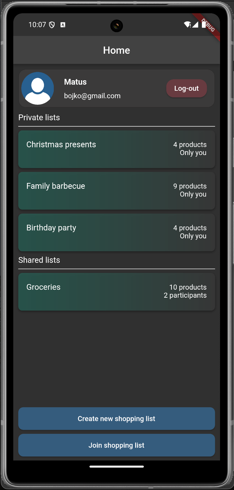
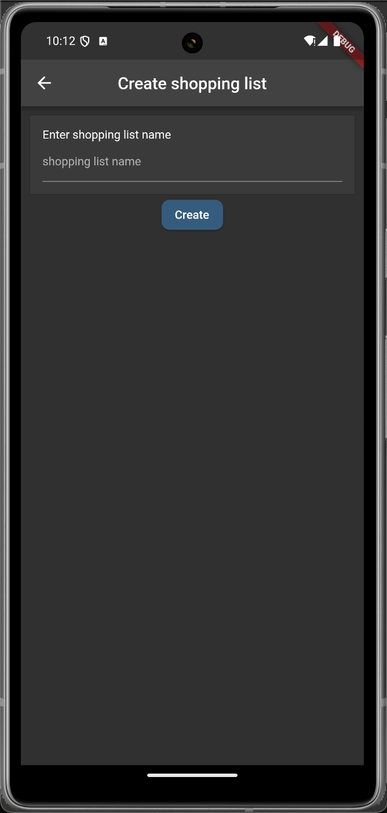
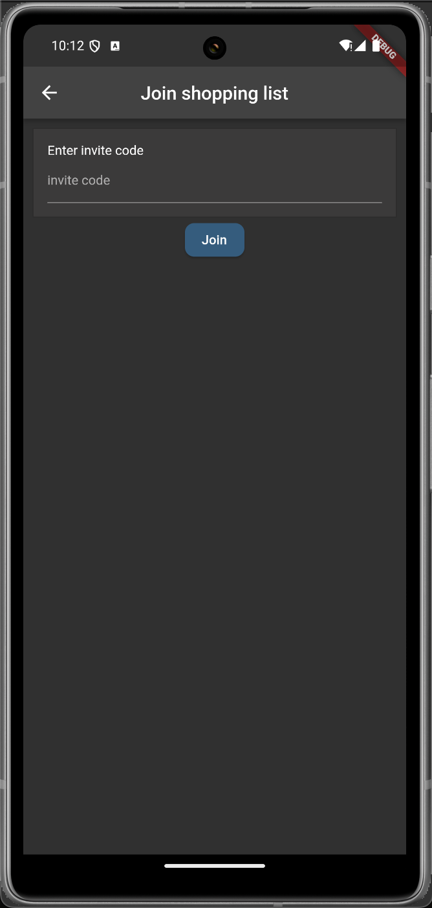
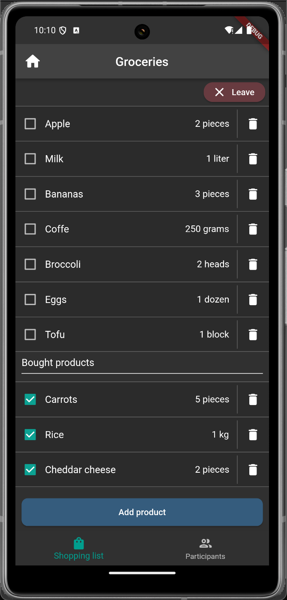
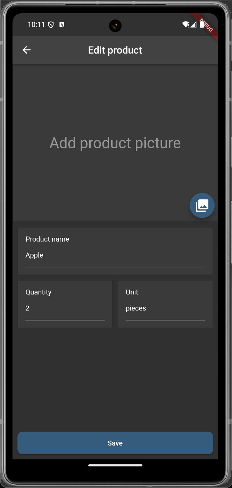
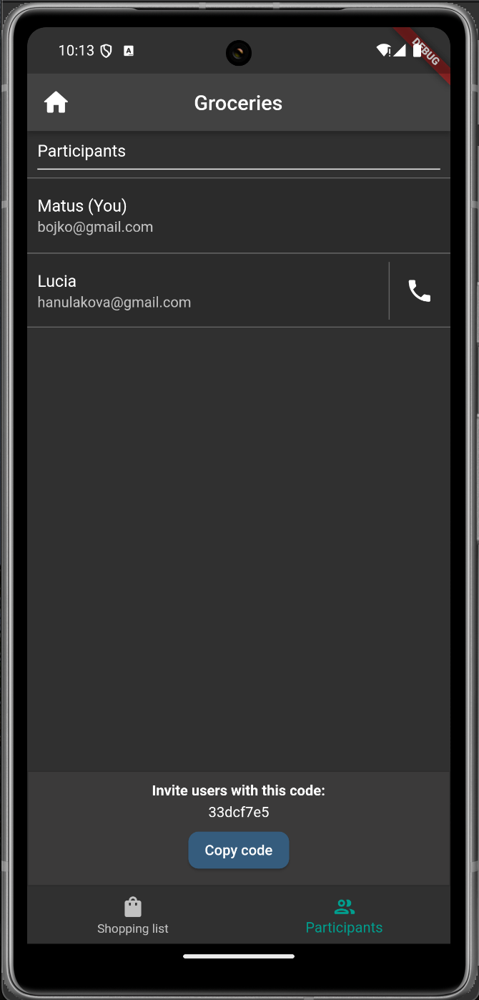
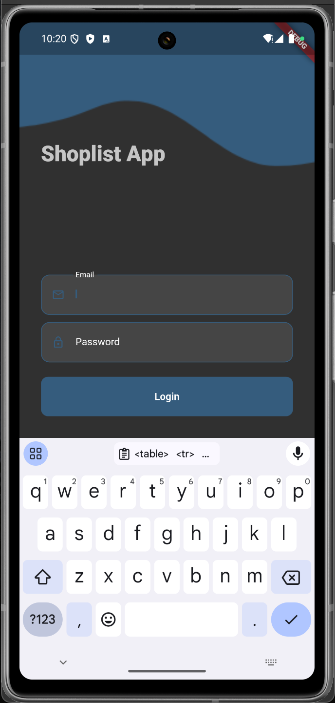
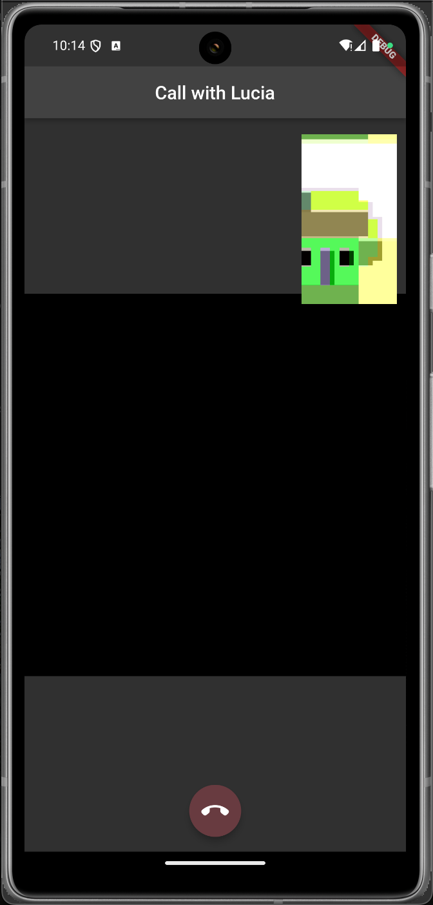

# ShopLists Mobile App

A collaborative cross-platform shopping list mobile application that enables users to create, share, and manage various types of product lists. The app features user authentication, list sharing capabilities, and video-call conferencing through WebRTC. This project was designed and developed as part of the MTAA 2022 course at FIIT STU.

[](https://flutter.dev)
[](https://dart.dev)
[](https://www.djangoproject.com)
[](https://firebase.google.com)
[](https://www.postgresql.org)

## Features

### User Authentication

- Secure login system with auto-login capability
- Persistent user sessions

### Shopping List Management

- **Shopping list management :** Create,delete new shopping lists with custom names
- **Join shared lists:** Join existing lists using invite codes
- **Shared management of products within lists:** - Create, edit and delete products withing lists

### Video Call

Built-in video call functionality using WebRTC an Firebase with support between 2 shoplist participants.

- **Call Interface:**
  - Real-time video streams for both local and remote participants
  - Camera switching capabilities during calls
  - Audio muting options
  - Call termination controls

### User Interface

- Material Design interface
- Pull-to-refresh functionality for list updates
- Loading indicators for network operations
- Error dialogs for connection issues
- Responsive layout supporting both portrait and landscape orientations

## Technology Stack

- **Frontend:** Flutter/Dart
- **Backend Integration:** Django, Firebase
- **Authentication:** Custom auth system with local session management
- **State Management:** Flutter's built-in state management
- **Database:** PostreSQL, Firebase

#### Technical Features

- Django REST API for list, product and call room management
- Firebase integration for rooms and offers for calls
- Local data persistence for user sessions
- Cross-platform support (iOS and Android)

## UI Screens

<table>
  <tr>
    <td></td>
    <td></td>
    <td></td>
  </tr>
  <tr>
    <td align="center"><b>Home Screen</b></td>
    <td align="center"><b>Create list Screen</b></td>
    <td align="center"><b>Join list Screen</b></td>
  </tr>
</table>

<table>
  <tr>
    <td></td>
    <td></td>
    <td></td>
  </tr>
  <tr>
    <td align="center"><b>List Screen</b></td>
    <td align="center"><b>Add/Edit product Screen</b></td>
    <td align="center"><b>List participants Screen</b></td>
  </tr>
</table>

<table>
  <tr>
    <td></td>
    <td></td>
  </tr>
  <tr>
    <td align="center"><b>Login Screen</b></td>
    <td align="center"><b>Call Screen</b></td>

  </tr>
</table>

## Installation

1. **Prerequisites**

   - Flutter SDK (>=2.16.1 <3.0.0)
   - Dart SDK
   - Android Studio/VS Code with Flutter plugins
   - iOS development tools (for iOS deployment)

2. **Clone the Repository**

   ```bash
   git clone [repository-url]
   cd shoplist_project
   ```

3. **Install Dependencies**

   ```bash
   flutter pub get
   ```

4. **Configure backend URL**

   - Update the host variable in `lib/models/global_settings.dart`:
     ```dart
     // For Android Emulator
     String host = "http://10.0.2.2:8000/";
     // For iOS Simulator
     String host = "http://127.0.0.1:8000/";
     // For Physical Devices
     String host = "http://your-local-ip:8000/";
     ```

5. **Run the Application**
   ```bash
   flutter run
   ```
